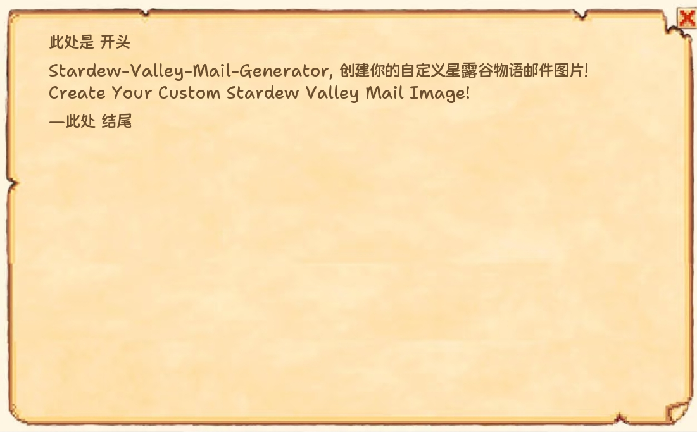

# 星露谷信件生成器

<div style="text-align:center">
  
</div>

<div style="text-align:center">
  自定义生成星露谷信件图片
</div>

## 安装依赖

```bash
pip install -r requirements.txt
```

## 项目结构

```
mail_generator/
├── config/
│   ├── generate_setting.json  # 生成器配置文件
│   └── mail_content.json      # 邮件内容配置文件
├── fonts/
│   └── Kingnammm-Maiyuan.ttf  # 默认字体文件
├── images/
│   └── mail.png               # 背景图片
├── src/
│   ├── generator.py           # 主程序
│   └── loader.py              # 配置加载器
├── output/                    # 输出目录
│   └── result.png             # 生成的图片
├── requirements.txt           # 项目依赖
└── README.md                  # 说明文档
```

## 使用方法

### 配置文件说明

#### generate_setting.json
```json
{
    "background_path": "mail.png",      // 背景图片名字，存放在 images/
    "use_system_font": false,           // 是否使用系统字体
    "font_path": "path/to/font",        // 自定义字体路径
    "font_size": 27,                    // 字体大小
    "margin_left": 7,                   // 左边距（百分比）
    "margin_top": 7,                    // 上边距（百分比）
    "margin_right": 7,                  // 右边距（百分比）
    "paragraph_spacing": 10,            // 段落间距（像素）
    "line_spacing": 8,                  // 行间距（像素）
    "text_color": [108, 79, 45]         // 文字颜色
}
```

其中，文字颜色支持 RGB 和 十六进制表示
```json
{
    "text_color": [108, 79, 45],     // ok
    "text_color": "#6C4F2D"          // ok
}
```

#### mail_content.json
```json
{
    "title": "标题",
    "paragraph": "正文内容\n可以使用\\n换行",
    "sign": "署名"
}
```

2. 运行程序

```bash
python src/generator.py
```

生成的图片将保存在 `output/result.png`

## 更新计划
- 增加 PC 的 GUI 版本。
- 增加 星露谷原信件含有的 附有xxx 内容
- 使用 React Native 重写，发布安卓移动版应用
