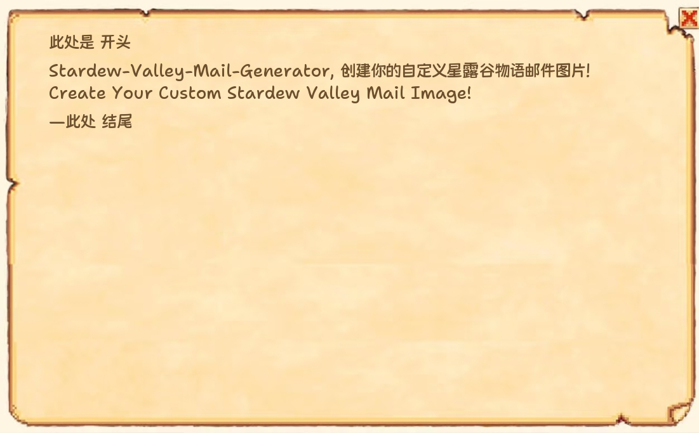

# Stardew Valley Letter Generator

English | [简体中文](./README.md)

<div style="text-align:center">
  
</div>

<p style="text-align:center">
  Generate custom Stardew Valley style letters
</p>

## Installation

```bash
pip install -r requirements.txt
```

## Project Structure

```
mail_generator/
├── config/
│   ├── generate_setting.json  # Generator configuration
│   └── mail_content.json      # Letter content
├── fonts/
│   └── Kingnammm-Maiyuan.ttf  # Default font
├── images/
│   └── mail.png               # Background image
├── src/
│   ├── generator.py           # Main program
│   └── loader.py              # Configuration loader
├── output/                    # Output directory
│   └── result.png             # Generated image
├── requirements.txt           # Dependencies
└── README.md                  # Documentation
```

## Usage

### Configuration Files

#### generate_setting.json
```text
{
    "background_path": "mail.png",      // Background image name in images/
    "use_system_font": false,           // Whether to use system font
    "font_path": "path/to/font",        // Custom font path
    "font_size": 27,                    // Font size
    "margin_left": 7,                   // Left margin (percentage)
    "margin_top": 7,                    // Top margin (percentage)
    "margin_right": 7,                  // Right margin (percentage)
    "paragraph_spacing": 10,            // Paragraph spacing (pixels)
    "line_spacing": 8,                  // Line spacing (pixels)
    "text_color": [108, 79, 45]         // Text color
}
```

Text color supports both RGB and hexadecimal formats:
```text
{
    "text_color": [108, 79, 45],     // ok
    "text_color": "#6C4F2D"          // ok
}
```

#### mail_content.json
```json
{
    "title": "Title",
    "paragraph": "Content\nUse \\n for line breaks",
    "sign": "Signature"
}
```

### Running the Program

```bash
python src/generator.py
```

The generated image will be saved to `output/result.png`

## Roadmap
- Add PC GUI version
- Add "Enclosed: xxx" content as in original Stardew Valley letters
- Rewrite using React Native and release Android mobile app 